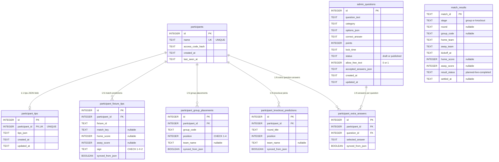

# VM2026 Database Schema

SQLite with WAL journal mode and foreign keys enabled.

## ER-diagram

## Unique Constraints

| Table | Columns |
|-------|---------|
| `participant_fixture_tips` | `(participant_id, fixture_id)` |
| `participant_group_placements` | `(participant_id, group_code, position)` |
| `participant_knockout_predictions` | `(participant_id, round_title, position)` |
| `participant_extra_answers` | `(participant_id, question_id)` |

## Indexes

| Index | Table | Columns |
|-------|-------|---------|
| `idx_fixture_tips_participant` | `participant_fixture_tips` | `(participant_id, updated_at)` |
| `idx_group_placements_participant_group` | `participant_group_placements` | `(participant_id, group_code)` |
| `idx_knockout_predictions_participant_round` | `participant_knockout_predictions` | `(participant_id, round_title)` |
| `idx_extra_answers_participant` | `participant_extra_answers` | `(participant_id)` |
| `idx_extra_answers_question` | `participant_extra_answers` | `(question_id)` |

## Notes

- `match_results` is standalone — linked to fixture tips via `fixture_id`/`match_key` in application code, not via FK
- `participant_tips` stores the full tips JSON blob (legacy); normalized tables (`_fixture_tips`, `_group_placements`, `_knockout_predictions`, `_extra_answers`) are the primary source
- `allow_free_text` + `accepted_answers_json` columns on `admin_questions` were added via migrations
